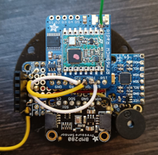
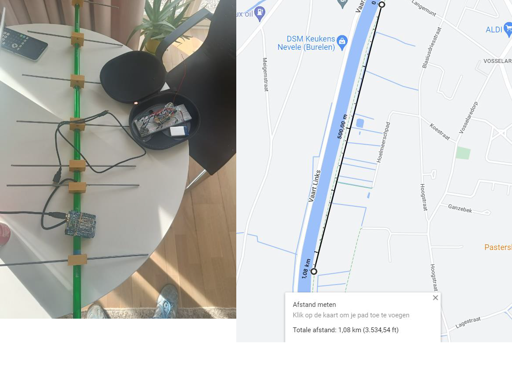
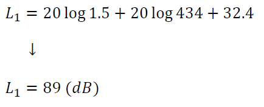
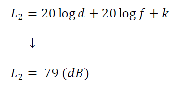
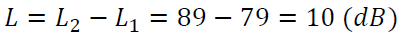

# CanSat AlphaSpot - High School Project

**Built in High School** - A complete satellite project that fits in a soda can!

> This project was one of my proudest achievements in high school. I built a functional satellite that collects atmospheric data, transmits GPS coordinates via radio, and visualizes the flight path in Google Earth.

## Overview

CanSat AlphaSpot is a student satellite project that demonstrates:
- **Hardware Engineering**: Custom PCB design, sensor integration
- **Embedded Programming**: Arduino firmware for data collection
- **Radio Communication**: RFM69 modules with custom Yagi antenna
- **Data Visualization**: Real-time GPS tracking in Google Earth
- **3D Simulation**: Flight path visualization in Blender

## What It Does

The CanSat collects and transmits:

- **Atmospheric Data**:
  - Pressure (BMP280 sensor)
  - Temperature (BMP280 sensor)
  - Altitude (calculated from pressure)
  
- **Motion Data**:
  - X, Y, Z acceleration (MPU6050 accelerometer)
  
- **GPS Data**:
  - Latitude, Longitude, Altitude
  - Transmitted in real-time via radio

All data is logged to an SD card and GPS coordinates are transmitted to a ground station.

## Hardware Components

### Onboard (CanSat)
- Arduino Feather M0 Express
- Featherwing prototyping shield
- BMP280 (Pressure/Temperature sensor)
- MPU6050 (Accelerometer)
- GPS Breakout V3
- RFM69 Radio Module (transmitter)
- SD Card Logger
- Re-Lithium battery (3.7V 1500mAh)
- Buzzer (audio feedback)

### Ground Station
- Arduino Uno
- RFM69 Radio Module (receiver)
- Custom 7-element Yagi Antenna
- PC with Python script

## Radio Communication

### Custom Yagi Antenna Design

Designed and built a 7-element Yagi antenna for 434 MHz:
- **Frequency**: 434 MHz
- **Elements**: 7 (reflector, dipole, 5 directors)
- **Gain**: ~10 dB
- **Range**: 1.5 km (calculated and verified)

**Antenna Calculations**:
- Used path loss equations to determine required gain
- Designed using Yagi-Uda antenna calculator
- Boom length: 865 mm
- Custom built with copper rods

See the calculations below for details on the antenna design process.

## Software Components

### 1. Arduino Code (CanSat)
- **`official.ino`**: Main flight computer code
  - Sensor reading and data logging
  - GPS data acquisition
  - Radio transmission
  - SD card data storage

### 2. Arduino Code (Ground Station)
- **`receiver.ino`**: Ground station receiver
  - Receives GPS coordinates via radio
  - Outputs to serial port for Python script

### 3. Python Scripts
- **`live_gps.py`**: Real-time GPS tracking
  - Reads serial data from ground station
  - Creates KML file for Google Earth
  - Visualizes flight path in real-time

### 4. Blender Simulation
- **`blender_simulation.py`**: 3D flight path visualization
  - Creates 3D animation in Blender
  - Shows precise flight path in 3D space
  - Visualizes CanSat trajectory

## Project Structure

```
cansat-project/
├── README.md
├── src/
│   ├── arduino/
│   │   ├── official.ino          # Main CanSat code
│   │   └── receiver.ino          # Ground station receiver
│   ├── python/
│   │   └── live_gps.py           # GPS tracking visualization
│   └── blender/
│       └── blender_simulation.py # 3D flight path visualization
├── docs/
│   └── antenna_design.md         # Antenna calculations
└── images/
    ├── gps.png                   # GPS tracking in Google Earth
    ├── primary.png               # CanSat assembly photo 1
    ├── primary2.png              # CanSat assembly photo 2
    ├── primary21.png             # CanSat assembly photo 3
    ├── yagi.png                  # Custom Yagi antenna
    ├── eq1.png                   # Antenna equation 1
    ├── eq2.png                   # Antenna equation 2
    ├── eq3.png                   # Antenna equation 3
    └── eq5.png                   # Antenna equation 5
```

## Setup & Usage

### Prerequisites

**Hardware:**
- Arduino Feather M0 Express
- Arduino IDE with required libraries:
  - Adafruit_BMP280
  - Adafruit_MPU6050
  - Adafruit_GPS
  - RadioHead (RH_RF69)
  - SD

**Software:**
- Python 3.8+
- pyserial library

### Installation

1. **Clone the repository**
   ```bash
   git clone <repository-url>
   cd cansat-project
   ```

2. **Install Python dependencies**
   ```bash
   pip install -r requirements.txt
   ```
   
   Or manually:
   ```bash
   pip install pyserial
   ```

3. **Upload Arduino code**
   - Open `src/arduino/official.ino` in Arduino IDE
   - Install required libraries
   - Upload to Feather M0 Express
   - Upload `receiver.ino` to Arduino Uno

4. **Run GPS tracker**
   ```bash
   python src/python/live_gps.py
   ```
   - Update COM port in script to match your system
   - Opens `position.kml` in Google Earth

5. **Create Blender simulation** (Optional)
   - Open Blender
   - Run `src/blender/blender_simulation.py` script
   - Ensure GPS data file path is correct
   - Creates 3D animation of flight path

## Screenshots

### GPS Tracking in Google Earth

Real-time visualization of the CanSat flight path after a test walk through the city:


### Hardware Assembly

CanSat assembly photos showing the internal components:

 


### Custom Yagi Antenna

The custom-built 7-element Yagi antenna for radio communication:



### Antenna Design Calculations

Mathematical calculations used to design the antenna:








## What I Learned

This project taught me:

- **Embedded Systems**: Programming microcontrollers for real-time data collection
- **Sensor Integration**: Working with multiple sensor types (pressure, accelerometer, GPS)
- **Radio Communication**: Understanding RF propagation and antenna design
- **Data Logging**: Efficient data storage on SD cards
- **3D Visualization**: Creating visual representations of flight data
- **Project Management**: Planning and executing a complex multi-disciplinary project

## Technical Details

### Data Collection Rate
- Sensor data: Continuous sampling
- GPS data: 5 Hz update rate
- Radio transmission: Real-time GPS coordinates

### Data Format
- **data.csv**: Time, pressure, temperature, altitude, accelerations
- **gps.csv**: Altitude, latitude, longitude
- **KML file**: XML format for Google Earth visualization

### Radio Specifications
- **Frequency**: 434.50 MHz (ISM band)
- **Power**: 20 dBm (maximum)
- **Encryption**: AES-128
- **Range**: 1.5 km with custom Yagi antenna

## Documentation

- Original project reports (in Dutch)
- Antenna design calculations (see images above)
- Electrical schematics
- 3D model files (Blender)

### Antenna Design Details

The antenna design process involved:

1. **Path Loss Calculations**: Used Friis transmission equation to determine required antenna gain
2. **Yagi-Uda Calculator**: Used online calculator to design the 7-element antenna
3. **Physical Construction**: Built antenna with copper rods according to calculated dimensions
4. **Testing**: Verified 1.5 km range in field tests

The mathematical approach shows how theoretical RF engineering principles were applied to solve a real-world problem.

## Achievements

- Successfully collected atmospheric data during flight
- Achieved 1.5 km radio range with custom antenna
- Real-time GPS tracking worked perfectly
- All sensors functioned correctly during flight
- Data logged successfully to SD card

## Future Improvements

If rebuilding this project, I would:
- Add data compression for more efficient storage
- Implement error correction for radio transmission
- Add real-time telemetry dashboard
- Improve parachute deployment mechanism
- Add camera module for video recording

## License

This project is provided as-is for portfolio demonstration purposes.

## Author

**Jean Knecht**
- High School Project (Year)
- Built with passion for aerospace and embedded systems

---

**Note**: This project represents my work in high school. The code has been modernized for portfolio purposes, but the original concept and functionality remain intact.

> "From high school dream to working satellite - this project sparked my passion for aerospace engineering!"

