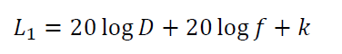
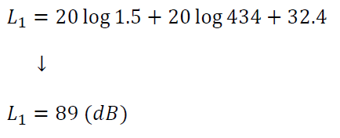
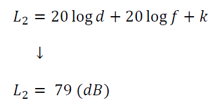

# Software

## Official 
program, run on the arduino Feather m0 Express, that 	takes the measurements. 
- controls the sensors (BMP280 and MPU6050
- stores the data of the sensors on a SD card
- retrieves gps data (GPS breakout v3)
- sends GPS coordinates through the radio module
## receiver
program, run on a arduino uno, that retrieves the gps
coordinates send by the arduino Feather.
- Antenna: a 7 element yagi antenna with the dipole connected to a radio module
## live gps
program, run on a pc, that takes the gps coordinates that are retrieved from the antenna and places them in google earth in wich you can then see the live location of the cansat
## raket
makes a simulation with the gps coordinates in blender to precisely see the path of the cansat in 3D

# Mechanical

## Antenna
To receive the data that will be send by a radio module with a smaller vertical antenna, an antenna is needed. The antenna consists of a reflector, a dipole and a x number of directors. The number of directors will determine how much a certain signal is amplified, expressed in decibels. 
To work as efficiently as possible, we have used the following calculations to theoretically determine how many directors x we need. These are the values we worked with:

- f (frequency) = 434 Mhz 
- d (default range without antenna) = 500 m = 0.5 km 
- D (range that we want to achieve) = 1500m = 1.5 km 
With these values we can determine the gain we need for our antenna and thus the number of directors.
We can calculate the path loss L for a signal with frequency f and a distance D with the following equation:

(with k being a constant and depends on the material in which the signal propagates. In air -> k = 32.4) 
and when we enter the values:

If we do the same with the default range d of the radio module (when a small vertical antenna is attached)
 

To achieve distance D (1.5 km), the Yagi-antenna needs to have a gain L of: ??=??2???1=89?79=10 (????) 
This is the first value that is important to determine the amount of directors x we need. 
To calculate the amount of directors x we used a program called “Yagi Uda Atenna Calcultor” which can be found on the following website: Online Calculator .:. Yagi Uda Antenna based on DL6WU (changpuak.ch) 
The program takes following parameters in account:
Input
------
- Frequency : 434 Mhz 
- Boom diameter: 17mm 
- Rod diameter: 4mm 
- Number of directors: x 
Output
------
Gain: 10 dB 
(lengths and distances)

And if we now enter a different number of directors each time, we can search for the ideal combination so that we have a gain of about 10 db. 
And the result is: 

- Frequency : 434 MHz 
- Wavelength : 691 mm 
- Rod Diameter : 4 mm 
- Boom Diameter : 17 mm 
- Boom Length : 865 mm 
- d/lambda : 0.006 ( min.: 0.002 , max.: 0.01 ) 
- D/lambda : 0.025 ( min.: 0.01 , max.: 0.05 ) 
- Elements : 7 
- Gain : 9.88 dBd (approx.) 
So the number of director needed is 7 – 2 (dipole and reflector) = 5 
